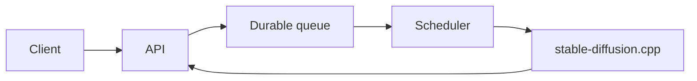

# Stable Diffusion Platform

Asynchronous image inference platform powered by `stable-diffusion.cpp`.

Built with **NestJS + Fastify**, **Effect**, **Drizzle + SQLite**, and **Bun**. Jobs are persisted in a durable queue and scheduled across one or more inference engines.

## Table of contents

- [Stable Diffusion Platform](#stable-diffusion-platform)
  - [Table of contents](#table-of-contents)
  - [Compatibility](#compatibility)
  - [Prerequisites](#prerequisites)
  - [Architecture](#architecture)
  - [Setup](#setup)
  - [Run](#run)
  - [API](#api)
  - [Commands](#commands)

## Compatibility

| Backend | Profile  |
| ------- | -------- |
| CPU     | `cpu`    |
| CUDA    | `cuda`   |
| ROCm    | `rocm`   |
| Vulkan  | `vulkan` |
| Metal   | external |

Metal runs through an external `sd-server` configured with `ENGINE_URL`.

## Prerequisites

- [Bun](https://bun.sh/)
- [Docker](https://www.docker.com/) and Docker Compose
- A [`stable-diffusion.cpp`](https://github.com/leejet/stable-diffusion.cpp) compatible model

## Architecture



## Setup

```bash
bun install
cp .env.example .env
```

Configure at least:

```env
PLATFORM_API_KEY=[API_KEY]
```

Models can be placed in the configured model directory or downloaded automatically:

```env
MODEL__SD15=https://huggingface.co/.../model.safetensors
```

## Run

Local development:

```bash
bun run dev
```

Docker:

```bash
docker compose --profile [cpu|cuda|rocm|vulkan] up --build -d
```

Run the checks:

```bash
bun run verify
```

## API

All `/v1` routes require:

```http
Authorization: Bearer ${PLATFORM_API_KEY}
```

| Method   | Route                         | Description               |
| -------- | ----------------------------- | ------------------------- |
| `POST`   | `/v1/jobs`                    | Create a generation job   |
| `GET`    | `/v1/jobs/:id`                | Get job state and results |
| `DELETE` | `/v1/jobs/:id`                | Cancel a job              |
| `GET`    | `/v1/jobs/:id/results/:index` | Get a generated image     |
| `GET`    | `/v1/engines`                 | Get engine states         |
| `GET`    | `/v1/metrics`                 | Get platform metrics      |
| `GET`    | `/health/live`                | Liveness check            |
| `GET`    | `/health/ready`               | Readiness check           |

Example:

```bash
curl -X POST http://localhost:3000/v1/jobs \
    -H "authorization: Bearer ${PLATFORM_API_KEY}" \
    -H "content-type: application/json" \
    -d '{
      "cfgScale": 7,
      "count": 1,
      "height": 1024,
      "model": "default",
      "prompt": "a lighthouse in a storm",
      "steps": 30,
      "width": 1024
    }'
```

## Commands

| Command                     | Description                 |
| --------------------------- | --------------------------- |
| `bun run dev`               | Start development           |
| `bun run build`             | Build the release binary    |
| `bun run verify`            | Run all checks              |
| `bun test`                  | Run tests                   |
| `bun run database:generate` | Generate Drizzle migrations |
