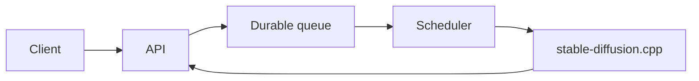

# Image Generation Orchestrator

Asynchronous image inference platform powered by `stable-diffusion.cpp`.

Built with **NestJS + Fastify**, **Effect**, **Drizzle + SQLite**, and **Bun**. Jobs are persisted in a durable queue and scheduled across one or more inference engines.

## Table of contents

- [Image Generation Orchestrator](#image-generation-orchestrator)
  - [Table of contents](#table-of-contents)
  - [Compatibility](#compatibility)
  - [Prerequisites](#prerequisites)
  - [Architecture](#architecture)
  - [Setup](#setup)
  - [Run](#run)
  - [API](#api)
    - [Create a generation job](#create-a-generation-job)
    - [Get job state and results](#get-job-state-and-results)
    - [Cancel a job](#cancel-a-job)
    - [Get a generated image](#get-a-generated-image)
    - [Get engine states](#get-engine-states)
    - [Get platform metrics](#get-platform-metrics)
    - [Liveness check](#liveness-check)
    - [Readiness check](#readiness-check)
  - [Documentation](#documentation)
  - [Commands](#commands)

## Compatibility

| Backend | Profile  |
| ------- | -------- |
| CPU     | `cpu`    |
| CUDA    | `cuda`   |
| ROCm    | `rocm`   |
| Vulkan  | `vulkan` |
| Metal   | external |

Metal runs through an external `sd-server` configured with `ENGINE_URL`.

## Prerequisites

- [Bun](https://bun.sh/)
- [Docker](https://www.docker.com/) and Docker Compose
- A [`stable-diffusion.cpp`](https://github.com/leejet/stable-diffusion.cpp) compatible model

## Architecture



## Setup

```bash
bun install
cp .env.example .env
```

Configure at least:

```env
PLATFORM_API_KEY=[API_KEY]
```

Models can be placed in the configured model directory or downloaded automatically:

```env
MODEL__SD15=https://huggingface.co/.../model.safetensors
```

## Run

Local development:

```bash
bun run dev
```

Docker:

```bash
docker compose --profile [cpu|cuda|rocm|vulkan] up --build -d
```

Run the checks:

```bash
bun run verify
```

## API

Every `/v1` route requires the API key as a bearer token. The health probes are
the only unauthenticated routes.

```http
Authorization: Bearer ${PLATFORM_API_KEY}
```

| Method   | Route                         | Description               |
| -------- | ----------------------------- | ------------------------- |
| `POST`   | `/v1/jobs`                    | Create a generation job   |
| `GET`    | `/v1/jobs/:id`                | Get job state and results |
| `DELETE` | `/v1/jobs/:id`                | Cancel a job              |
| `GET`    | `/v1/jobs/:id/results/:index` | Get a generated image     |
| `GET`    | `/v1/engines`                 | Get engine states         |
| `GET`    | `/v1/metrics`                 | Get platform metrics      |
| `GET`    | `/health/live`                | Liveness check            |
| `GET`    | `/health/ready`               | Readiness check           |

The machine-readable contract is served by the platform itself:

| Route              | Description                        |
| ------------------ | ---------------------------------- |
| `/v1/docs`         | Swagger UI reference               |
| `/v1/openapi.json` | OpenAPI 3.1 document               |

Both are unauthenticated: a specification a client cannot read without already
holding a key is of no use to the tooling that consumes it.

Failures share one body across every route, so a client branches on `code` and
never parses `message`:

```json
{ "code": "JOB_NOT_FOUND", "message": "job or result not found" }
```

### Create a generation job

Accepts the request into the durable queue and returns immediately with status
`queued`. `count`, `steps`, `width` and `height` are bounded by both the public
schema and the deployment limits, whichever is stricter.

```bash
curl -X POST http://localhost:3000/v1/jobs \
    -H "authorization: Bearer ${PLATFORM_API_KEY}" \
    -H "content-type: application/json" \
    -d '{
      "cfgScale": 7,
      "count": 1,
      "height": 1024,
      "model": "default",
      "negativePrompt": "blurry, low quality",
      "outputFormat": "png",
      "prompt": "a lighthouse in a storm",
      "seed": 42,
      "steps": 30,
      "width": 1024
    }'
```

```json
{
  "cancelRequested": false,
  "createdAt": "2026-08-16T09:12:04.118Z",
  "error": null,
  "id": "9f1ddf57-fa12-42d8-9bd1-9e6e497c84e1",
  "progress": null,
  "request": {
    "cfgScale": 7,
    "count": 1,
    "height": 1024,
    "model": "default",
    "negativePrompt": "blurry, low quality",
    "outputFormat": "png",
    "prompt": "a lighthouse in a storm",
    "seed": 42,
    "steps": 30,
    "width": 1024
  },
  "resultUrls": [],
  "startedAt": null,
  "status": "queued",
  "updatedAt": "2026-08-16T09:12:04.118Z"
}
```

`400` on a schema or limit violation, `429` when the caller is rate limited,
`503` when the queue is full or no engine serves the requested model.

### Get job state and results

Poll this route to follow the job. `resultUrls` fills once the status reaches
`succeeded`; `progress` counts sampling steps across the whole job and stays
`null` unless the engine reports them.

```bash
curl http://localhost:3000/v1/jobs/9f1ddf57-fa12-42d8-9bd1-9e6e497c84e1 \
    -H "authorization: Bearer ${PLATFORM_API_KEY}"
```

```json
{
  "cancelRequested": false,
  "createdAt": "2026-08-16T09:12:04.118Z",
  "error": null,
  "id": "9f1ddf57-fa12-42d8-9bd1-9e6e497c84e1",
  "progress": {
    "completed": 18,
    "total": 30
  },
  "request": {
    "cfgScale": 7,
    "count": 1,
    "height": 1024,
    "model": "default",
    "negativePrompt": "blurry, low quality",
    "outputFormat": "png",
    "prompt": "a lighthouse in a storm",
    "seed": 42,
    "steps": 30,
    "width": 1024
  },
  "resultUrls": [],
  "startedAt": "2026-08-16T09:12:05.402Z",
  "status": "running",
  "updatedAt": "2026-08-16T09:12:41.906Z"
}
```

A terminal job carries its failure in `error` and its images in `resultUrls`:

```json
{
  "error": {
    "code": "GENERATION_FAILED",
    "message": "image generation failed"
  },
  "status": "failed"
}
```

### Cancel a job

Cancels a queued job immediately. A running job is marked instead, and the
dispatcher forwards the request to the engine on its next poll, so the response
may still report `running`.

```bash
curl -X DELETE http://localhost:3000/v1/jobs/9f1ddf57-fa12-42d8-9bd1-9e6e497c84e1 \
    -H "authorization: Bearer ${PLATFORM_API_KEY}"
```

Answers `202` with the job, `409` when it is already terminal, `404` when it
does not exist.

### Get a generated image

Streams one image without buffering it. The response carries a strong `ETag`
built from the file digest and an immutable cache directive, so a result can be
cached indefinitely.

```bash
curl -o image.png \
    http://localhost:3000/v1/jobs/9f1ddf57-fa12-42d8-9bd1-9e6e497c84e1/results/0 \
    -H "authorization: Bearer ${PLATFORM_API_KEY}"
```

The index is zero-based and comes from `resultUrls`; a non-integer index is a
`400`, an index beyond the produced images a `404`.

### Get engine states

Lists the engines the scheduler can see. `healthy` accepts work, `degraded` is
failing its circuit breaker, `offline` is unreachable.

```bash
curl http://localhost:3000/v1/engines \
    -H "authorization: Bearer ${PLATFORM_API_KEY}"
```

```json
[
  {
    "backend": "cpu",
    "health": "healthy",
    "id": "primary",
    "maxConcurrent": 1,
    "models": ["default"],
    "provider": "stable-diffusion-cpp",
    "running": 1
  }
]
```

### Get platform metrics

Bounded counters with no user content and no per-job cardinality, so the
response is safe to scrape.

```bash
curl http://localhost:3000/v1/metrics \
    -H "authorization: Bearer ${PLATFORM_API_KEY}"
```

```json
{
  "engines": [
    {
      "backend": "cpu",
      "health": "healthy",
      "id": "primary",
      "maxConcurrent": 1,
      "models": ["default"],
      "provider": "stable-diffusion-cpp",
      "running": 1
    }
  ],
  "queuedJobs": 3
}
```

### Liveness check

Reports process liveness without touching storage or engines. Unauthenticated,
so a container runtime can probe it.

```bash
curl http://localhost:3000/health/live
```

```json
{
  "status": "live"
}
```

### Readiness check

Probes durable storage and every configured engine. Answers `503` while no
engine can serve a generation, which keeps traffic away during startup and
while models are still downloading.

```bash
curl http://localhost:3000/health/ready
```

```json
{
  "enginesAvailable": 1,
  "status": "ready"
}
```

## Documentation

```bash
bun run docs
bun run dev
```

| URL                                     | Description                       |
| --------------------------------------- | --------------------------------- |
| `http://localhost:3000/v1/docs`         | Swagger UI, with a request runner |
| `http://localhost:3000/v1/openapi.json` | OpenAPI 3.1 document              |

## Commands

| Command                     | Description                 |
| --------------------------- | --------------------------- |
| `bun run dev`               | Start development           |
| `bun run build`             | Build the release binary    |
| `bun run verify`            | Run all checks              |
| `bun test`                  | Run tests                   |
| `bun run docs`              | Generate the code reference |
| `bun run docs:serve`        | Serve the code reference    |
| `bun run database:generate` | Generate Drizzle migrations |
